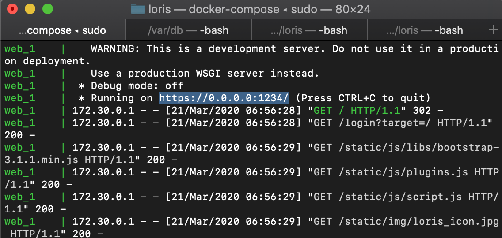
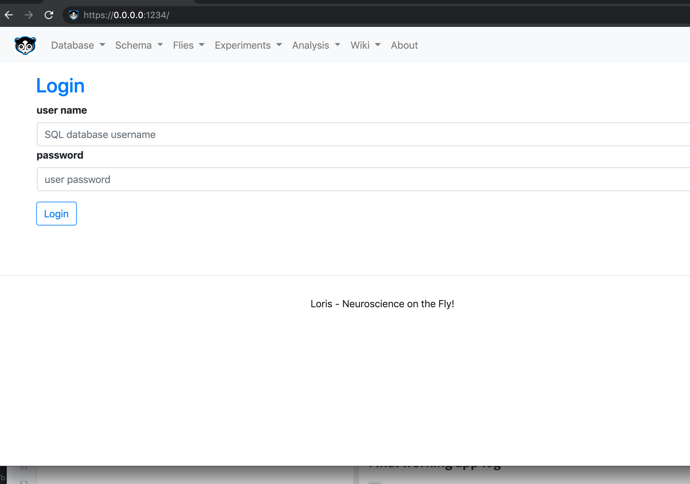

# Loris
### Database and Analysis application for a Drosophila Lab (or any lab)

Loris is in development with core features still being tested and added.
Documentation for the different features will be added soon.

## Requirements

* Anaconda
* Docker

## Pulling the source code

Pull the recent version of Loris:
```
git pull https://github.com/gucky92/dreye.git
git submodule update --init --recursive
```

## Installation of API

Create a new conda environment using the yml file provided and install all submodules:
```
cd loris
conda env create -f loris.yml -n loris
conda activate loris
pip install -e datajoint-python/.
pip install -e .
```

## Method 1: Running App after API Installation

Create your own `config.json` file. There is a template file called `_config.json`.

If you do not have a running MySQL database yet, you can install a running SQL database using the docker-compose submodule provided by Loris:
```
cd mysql-docker/slim
sudo docker-compose up -d
```

To run the Loris app (in the main loris directory):
```
conda activate loris  # activate the environment if you haven't done so
python run.py
```
The app should now be running on port 1234.

## Method 2: Running app through a Docker image
Another form of running the app without having to install the package manually is to run our docker image. Make sure you have pulled the code as in the
*Pulling the source code* heading.
**Make sure nothing is running on ports 1234 and 3306**.

```
cd loris
sudo docker-compose up
OR
sudo docker-compose up -d   # runs the docker in the background
```
You might encounter the following error/warning that you can *ignore* safely:
```
pymysql.err.OperationalError: (2003, "Can't connect to MySQL server on 'mysql' ([Errno 111] Connection refused)")
```

You can initially login with as *administrator* with password *fruitfly*.

### Final working app when installing with docker



### Troubleshooting

Make sure to prune all your images, if the app did not run the first time around, and remove the database folder in loris (if it exists):

```
docker stop $(docker ps -aq)
docker rm $(docker ps -aq)
docker rmi $(docker images -q)
docker system prune -a
```
