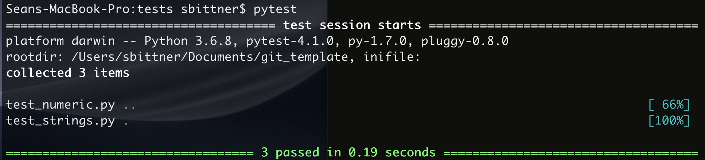
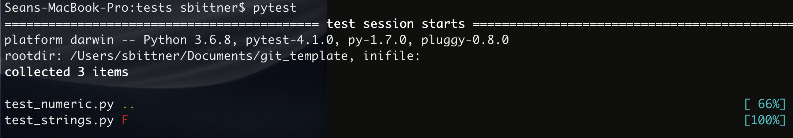
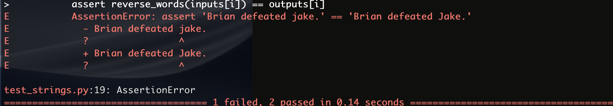

<script src='https://cdnjs.cloudflare.com/ajax/libs/mathjax/2.7.5/latest.js?config=TeX-MML-AM_CHTML' async></script>


<div class="topnav">
  <a class="active" href="#">Home</a>
  <a href="../git_template/page2">Docs</a>
  <a href="../git_template/page3">Tutorial</a>
</div>

# Professional coding practices #
This semester, we had a discussion on professional coding practices in python.  I’ve compiled these ideas into a template repo, which can get you off the ground with gitpage documentation, packaging, unit testing, and continuous integration.  On this gitpage, I'll explain the functionality of the template, and how to adapt it for your project.  The end of each section contains tips and rules of thumb for each topic.


## Using the template ##

To use this as a template for a new git repository:
1. Sign into (or create) your github account on [https://github.com](https://github.com){:target="_blank"}.
2. Click the plus button on the top-right of the screen, and select “Import Repository.”
3. Under “Your old repository's clone URL” type \\
`https://github.com/cunningham-lab/git_template.git`
4. Name your repository, select privacy setting, and click the "Begin Import" button.

Your new repo will inherit the files and commit history of the git_template repository, and you can edit to your liking from here.

## Online documentation ##
The webpage you are currently reading is the gitpage for the `git_template` repo.  Gitpages can be project-specific documentation websites, or standalone sites unafilliated with a particular repo.  Every git repo has a reserved gitpage url derived from the repo name and owner. 

For example, the repo for git_template owned by cunningham-lab is located at the familiar location. \\
[https://github.com/cunningham-lab/git_template](https://github.com/cunningham-lab/git_template){:target="_blank"}

And, the url for the gitpage follows the pattern `http://<owner name>.github.io/<repo name>/` \\
[https://cunningham-lab.github.io/git_template/](https://cunningham-lab.github.io/git_template/){:target="_blank"}

To enable the gitpage for your `git_template` derived repo:
1. Click the "Settings" tab on the home page of your repo.
2. Go to section titled "GitHub Pages" and click the "Source" dropdown list.
3. Select "Master branch /docs folder"

This will enable the default `git_template` gitpage (this exact webpage) according to the markdown (.md) files in the `docs/` folder of the git repo. The home page is `docs/index.md`, which links to other markdown files for other website pages. You should replace the text for these pages with content for your project.  You can change the number of pages in the navigation bar by editing lines (8-11) of `docs/index.md`, and the analagous lines on the linked pages.  Editing the _config.yml file can change many gitpage properties, most notably the overall theme, main header and description that are consistent across pages.

Every time you push a new change to the `docs/` folder, github rebuilds your website with jekyll based on the new markdown source.  To edit your website source locally and view your changes, you can download jekyll and build your website using the following guide: \\
[https://help.github.com/en/articles/setting-up-your-github-pages-site-locally-with-jekyll](https://help.github.com/en/articles/setting-up-your-github-pages-site-locally-with-jekyll){:target="_blank"}

Once installing jekyll, compile and view your gitpage locally by:
1. Going to your docs folder in a terminal ```cd docs/``` .
2. Run ```jekyll serve bundle exec``` .
3. Go to address ```http://127.0.0.1:4000/``` in a browser to view the compiled website.


#### Automatically generated documentation ####
You can automatically generate markdown documentation given function docstrings using the python package [pydocmd](https://github.com/NiklasRosenstein/pydoc-markdown/tree/master/pydocmd){:target="_blank"}.  In order to update the gitpage documentation with your most up-to-date docstrings, you can 1.) Run pydocmd to generate the desired markdown, 2.) place it appropriately in your gitpage markdown source files, and then 3.) push the changes to your gitpage.  

While gitpages are a natural place to put your online documentation, they are not ideal in terms of automated doc generation. This may be three too many steps for someone keen on having maximal workflow automation. For automatic docstring-based documentation updates, you can use [ReadTheDocs with Sphinx](https://docs.readthedocs.io/en/latest/intro/getting-started-with-sphinx.html){:target="_blank"}.  If this is what you want, you can remove the /docs folder, disable the gitpage in settings, and setup readthedocs.

#### Documentation rules of thumb ####
* Online documentation, tutorials, etc. are useful resources for your user-base and collaborators, and are often worth the effort.
* Every function should have a docstring with a.) an appropriate description of what it does, b.) an arguments list defining the parameters, and c.) a returns list defining the outputs.
* Inline documention (throughout the function body using "#") should be used when it aids understanding of the purpose of a line(s) of code.  
* Inline documentation should always be in complete sentences with standard English grammar.

## Style ##
Software developers can get quite opinionated about style. This can lead to lengthy disagreements amongst team members, where project managers can be hard-pressed to please all parties. Most often, the time spent settling style debates could be better repurposed.  This is the philosophy behind [black](https://github.com/ambv/black){:target="_blank"}, the automated python code formatter, which is opinionated, so you don't have to be.  By running black on all project code, the style is automatically homogenized (no hand formatting), and mental energy can be saved for more important project tasks.  This repo template has a black code style badge, implying that its adopters will run black on their code before releasing it.  

To format your code with black:
1. ```pip install black```
2. ```black *.py```

#### Style rules of thumb ####
* Rather than wasting energy on determining style and hand-formatting, run automatic code formatters that are deterministic and opinionated for you.  
* Black is our preferred formatter, but there are other suitable formatters.
* You could write code in your "natural" style, and then constantly convert it using a formatter.  But ideally, you eventually correct your natural writing style to that of the formatter to streamline your interpretation and subsequent development of formatted files.


## Packaging ##
By packaging your python code, you are offloading the burdens of installation from your collaborators.  Getting installation right can be a surprisingly high barrier-to-entry for novice programmers, so taking care to make your code pip install-able can go a long way.  The gold standard of packaging python code is to release a stable version of your package with each susbstantial update, and register these releases in the [Python Package Index (PyPi)](https://pypi.org/){:target="_blank"}.  However, for earlier stages of pre-release code development, you can still use [setuptools](https://setuptools.readthedocs.io/en/latest/setuptools.html){:target="_blank"} so that users can install your package seamlessly using a local clone of the repository.

All it takes to package your python code is a setup.py script with the python module setuptools.  Here is the setup.py for the git_template repository.

**setup.py**
```python
#!/usr/bin/env python

from setuptools import setup

setup(name='git_template',
      version='0.1',
      description='Git template.',
      author='Sean Bittner',
      author_email='srb2201@columbia.edu',
      install_requires=['numpy'],
      packages=['git_template']
     )
```

Users can install the python package `git_template` by running either of the following commands in the base directory of the repository. \\
a.) `pip install .` \\
b.) `python setup.py install` 

And, if the user would like to be able to edit these packages, and have changes reflected in the package behavior: \\
a.) `pip install -e .` \\
b.) `python setup.py develop` 

The choices of input to `setup` in setup.py should be for the most part self-explanatory.  If there are additional dependencies for your repo, add them to the "install requires" list.  If you don't want the latest version of a dependency by default, you can require a specific version by using the "==".  
For example:
```python
install_requires=['numpy', 'tensorflow==1.13.1'],
```

#### Packaging rules of thumb ####
* Registering on PyPi should be done once code is thoroughly tested and ready for large-scale deployment.
* Earlier stage code should have a setup.py script that uses setuptools to make local code packagable.  This is necessary for continuous integration (see final section).

## Unit testing ##
One of the first things you learn in an introductory programming course is how important it is to write unit tests.  Once a function is designed, a good programmer determines a set of unit tests with good coverage to ensure proper implementation.  Once implemented, the programmer checks for any failed unit tests.

[Pytest](https://docs.pytest.org/en/latest/){:target="_blank"} is a convenient tool for running unit tests. Pytest auto-discovers testing scripts and has diagnostics for indicating why assert statements fail, modular fixtures, and other features that make it useful. By calling `pytest` in the base directory of a repo, pytest searches recursively for any ".py" files with the string "test" in the name.  Then, within each of these test files, discovers all functions with the string "test" in the function name, and executes them.  

Consider unit testing for two python modules `git_template/numeric.py` and `git_template/strings.py`, which contain 2 and 1 functions repsectively.  The unit testing scripts for these functions are `tests/test_numeric.py` and `tests/test_strings.py`.

**tests/test_numeric.py**
```python
import numpy as np
import time
from git_template.numeric import fib, prime_factors


def fib_naive(n):
    if n < 1 or (not isinstance(n, int)):
        return None
    elif n == 1 or n == 2:
        return n - 1
    else:
        return fib_naive(n - 1) + fib_naive(n - 2)


def test_fib():
    inputs = [-1, 0, 1, 2, 5, 10]
    outputs = [None, None, 0, 1, 3, 34]
    for i in range(len(inputs)):
        assert fib(inputs[i]) == outputs[i]

    fib_time_input = 20
    start_time = time.time()
    fib(fib_time_input)
    time_fib = time.time() - start_time

    start_time = time.time()
    fib_naive(fib_time_input)
    time_fib_naive = time.time() - start_time

    assert time_fib_naive > time_fib

    return None


def test_prime_factors():
    inputs = [-1, 0, 1, 2, 5, 10, 60, 49]
    outputs = [None, None, "", "2", "5", "25", "2235", "77"]
    for i in range(len(inputs)):
        assert prime_factors(inputs[i]) == outputs[i]

    return None


if __name__ == "__main__":
    test_fib()
    test_prime_factors()
```

**tests/test_strings**
```python
from git_template.strings import reverse_words


def test_reverse_words():
    inputs = [
        "Chicken produces egg.",
        "Reporters cover whales exploding.",
        "Are you as clever as I am?",
        # "Jake defeated Brian.",
    ]
    outputs = [
        "Egg produces chicken.",
        "Exploding whales cover reporters.",
        "Am I as clever as you are?",
        # "Brian defeated Jake.",
    ]

    for i in range(len(inputs)):
        assert reverse_words(inputs[i]) == outputs[i]

    return None


if __name__ == "__main__":
    test_reverse_words()
```

When `pytest` is run, all three unit testing functions are executed, passing each assert statement.


Notice the two green dots on the `test_numeric.py` line and only a single green dot on the `test_string.py` line.  Each green dot represents the ordered successful test functions within each script, and would instead be a red F, if any assert statements within had failed.  To get an idea of how pytest reports failed assert statements, uncomment the final line of the input and output lists in `test_reverse_words()`.


...

This test failure indicates that sentences begining with proper nouns will end in incorrectly uncapitalized proper nouns.  In practice, we would update our function `reverse_words` to handle these cases.

You can use these examples in the `git_template` to setup unit tests for your own project.

#### Unit-testing rules of thumb ####
* Modularize your code to reduce repetition and aid interpretability.
* Fast deterministic functions should be simple to test.  
* Random functions can be tested in expectation, bounds, etc.  
* Longer running functions like optimizations (especially non-convex ones) are less suitable for unit testing.

## Continuous integration ##
You can have a remote server automatically pull your repo, build it, and run your unit tests with a free service (for public repos) provided by [Travic CI](https://travis-ci.org/){:target="_blank"}.  This practice of automatically validating builds and tests regularly throughout development is called continuous integration.  Continuous integration is setup for the `git_template` repo, and the latest build result can be found here: [https://travis-ci.org/cunningham-lab/git_template](https://travis-ci.org/cunningham-lab/git_template){:target="_blank"}.

To setup continous integration for your public repo with Travis CI (you will have to go through these steps if you want continuous integration for an imported git_template):
1. Go to [https://travis-ci.org/](https://travis-ci.org/){:target="_blank"} .
2. Sign in with your Github account.
3. Select add new repository on the left.
4. Turn on Travis CI for the repo in the "Repositories" tab list.
5. Create a file `.travis.yml` in the base directory of your repo with these contents.
```python
language: python
python:
  - "3.6"
install:
  - pip install git+https://github.com/<owner name>/<repo name>.git
  - python setup.py -q install
script:
  - pytest
```
Change the python version if appropriate and add your owner and repo names.
6. Commit and push the `.travis.yml` file.
7. View your first automatic build check at `https://travis-ci.org/<owner name>/<repo name>`

Finally, edit the url for the build status sticker in the README.md to point to the status image for your travis build.

`<a href="https://travis-ci.org/<owner name>/<repo name>">/<repo name>.svg?branch=master"></a>`

#### Continuous integration rules of thumb ####
* Setup email notifications for failed builds.
* For responsive build checks, reduce computation necessary for unit tests.
* Long time-scale method/algorithm validation is likely best done outside of a continuous integration framework.

Hopefully, this template repo can serve as a launch point for projects incorporating some of the features listed above.  Feel free to get in touch with me at [srb2201@columbia.edu](#) for clarification or feedback.

Sean Bittner \\
April 11, 2019
